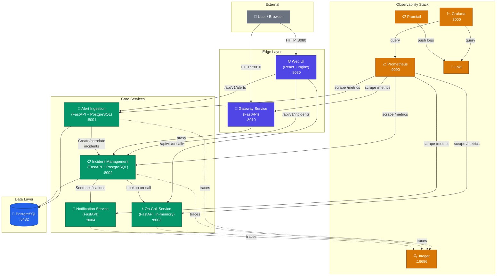
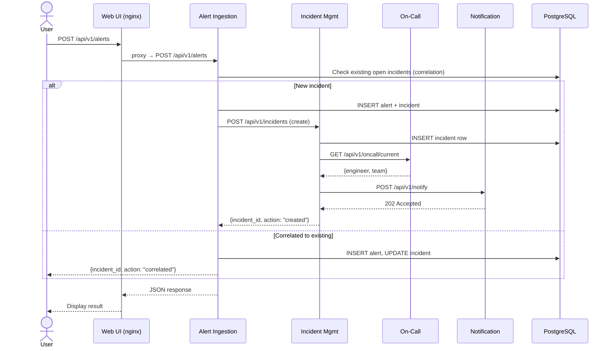

# Architecture

## System Overview

## Request Flow

## Deployment Topology

| Service               | Host Port | Internal Port | Scalable | Notes                        |
|-----------------------|-----------|---------------|----------|------------------------------|
| web-ui (nginx)        | 8080      | 8080          | ✗        | Static SPA + reverse proxy   |
| gateway               | 8010      | 8000          | ✗        | API gateway / proxy          |
| alert-ingestion       | —         | 8001          | ✓        | No host port; via nginx      |
| incident-management   | —         | 8002          | ✓        | No host port; via nginx      |
| oncall-service        | 8003      | 8003          | ✗        | In-memory schedules          |
| notification-service  | 8004      | 8004          | ✗        | Multi-channel (mock/email)   |
| PostgreSQL            | —         | 5432          | ✗        | Persistent volume            |
| Prometheus            | 9090      | 9090          | ✗        | dns_sd_configs for scaling   |
| Grafana               | 3000      | 3000          | ✗        | 3 dashboards auto-provisioned|
| Loki                  | —         | 3100          | ✗        | Log aggregation              |
| Promtail              | —         | 9080          | ✗        | Log shipper                  |
| Jaeger                | 16686     | 16686         | ✗        | Distributed tracing          |

## Docker Secrets

Sensitive credentials are managed via Docker Compose file-based secrets
(`deployment/secrets/`). Each Python service reads them at startup via
`_read_secret()` — no passwords are baked into images or environment variables.
