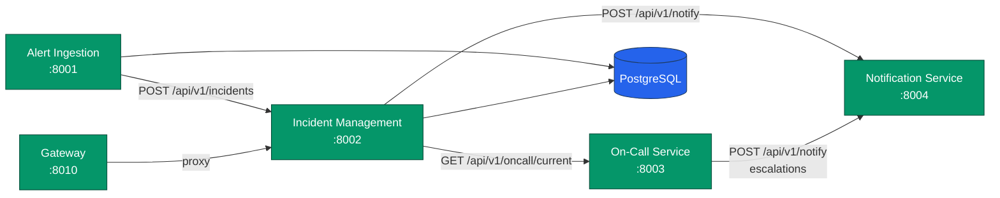
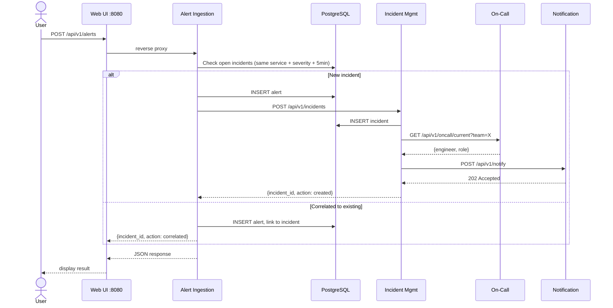

# Architecture

## System Overview

```
┌─────────────────────────────────────────────────────────────────────────┐
│                          DOCKER COMPOSE STACK                          │
│                                                                        │
│  ┌──────────┐   ┌──────────────────────────────────────────────────┐   │
│  │  👤 User  │──▶│  🌐 Web UI (React + Nginx) :8080                │   │
│  └──────────┘   │    Serves SPA + reverse-proxies /api/* calls     │   │
│                  └────────┬──────────┬──────────┬──────────────────┘   │
│                           │          │          │                       │
│               ┌───────────▼──┐  ┌────▼──────┐  ┌▼────────────┐        │
│               │ 🔔 Alert     │  │ 📋 Incident│  │ 📞 On-Call  │        │
│               │  Ingestion   │  │  Management│  │  Service    │        │
│               │  :8001       │  │  :8002     │  │  :8003      │        │
│               └──┬───────┬───┘  └──┬──┬──┬──┘  └─────────────┘        │
│                  │       │         │  │  │                              │
│                  │       └────────▶┘  │  │     ┌──────────────┐        │
│                  │    create/correlate │  └────▶│ 📣 Notify    │        │
│                  │                    │        │  Service      │        │
│                  │                    │        │  :8004        │        │
│               ┌──▼────────────────────▼──┐    └──────────────┘        │
│               │  🐘 PostgreSQL :5432     │                             │
│               │  (alerts + incidents)    │                             │
│               └──────────────────────────┘                             │
│                                                                        │
│  ┌── Observability ──────────────────────────────────────────────────┐ │
│  │  Prometheus :9090  ◀── scrapes /metrics from all services        │ │
│  │  Grafana    :3000  ◀── queries Prometheus + Loki                 │ │
│  │  Loki + Promtail   ◀── collects container logs                   │ │
│  │  Jaeger     :16686 ◀── receives OpenTelemetry traces             │ │
│  └───────────────────────────────────────────────────────────────────┘ │
│                                                                        │
│  🚪 Gateway :8010 — optional API proxy to incident-management         │
└─────────────────────────────────────────────────────────────────────────┘
```

## Service Communication



## Request Flow — Alert to Incident



## Deployment Topology

| Service               | Host Port | Internal Port | Notes                        |
|-----------------------|-----------|---------------|------------------------------|
| web-ui (nginx)        | 8080      | 8080          | Static SPA + reverse proxy   |
| gateway               | 8010      | 8000          | API gateway / proxy          |
| alert-ingestion       | —         | 8001          | No host port; via nginx      |
| incident-management   | —         | 8002          | No host port; via nginx      |
| oncall-service        | 8003      | 8003          | In-memory schedules          |
| notification-service  | 8004      | 8004          | Multi-channel (mock/email)   |
| PostgreSQL            | —         | 5432          | Persistent volume            |
| Prometheus            | 9090      | 9090          | dns_sd_configs for scaling   |
| Grafana               | 3000      | 3000          | 3 dashboards auto-provisioned|
| Loki                  | —         | 3100          | Log aggregation              |
| Promtail              | —         | 9080          | Log shipper                  |
| Jaeger                | 16686     | 16686         | Distributed tracing          |

## Observability

Every Python service exposes:
- **`/health`** — liveness probe (used by Docker healthchecks)
- **`/metrics`** — Prometheus-format metrics (`prometheus_client`)
- **OpenTelemetry traces** — auto-instrumented via `opentelemetry-instrumentation-fastapi`

Prometheus scrapes all services every 5s. Grafana has 3 auto-provisioned dashboards:

| Dashboard | Purpose |
|---|---|
| **Live Incident Overview** | Open incidents by severity, MTTA/MTTR gauges, alert timeline |
| **SRE Performance Metrics** | MTTA/MTTR trends (p50/p95), incident volume, escalations |
| **System Health** | CPU, memory, uptime, file descriptors, HTTP error rates |

## Docker Secrets

Sensitive credentials are managed via Docker Compose file-based secrets
(`deployment/secrets/`). Each Python service reads them at startup via
`_read_secret()` — no passwords are baked into images or environment variables.
